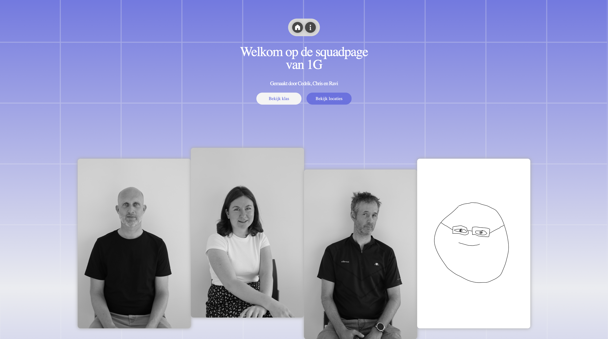
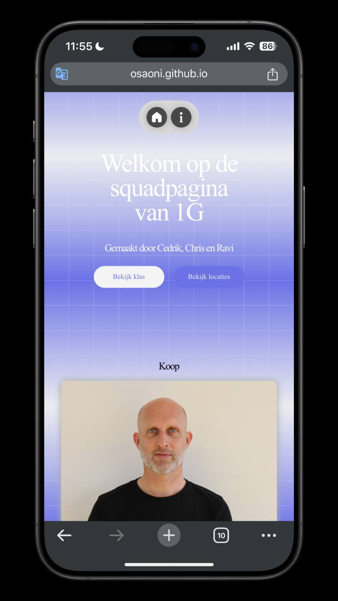

#### inhoudsopgave

[Responsive webdesign](#resposive-webdesign)

# Resposive webdesign 

Omdat het gebruik van mobiele telefoons en tablets etc.. op het internet toeneemt, is het belangrijk dat wij als toekomstige developers rekening houden om content op een manier te ontwerpen dat deze goed werkt voor verschillende schermformaten. Responsive webdesign wordt dit genoemt, is een ontwerpstratergie dat zich aanpast aan de behoeftes van gebruikers en de apparaten door de lay-out van de webpagina aan te passen aan de grootte van het scherm.

Naast dat de lay-out zich moet aanpassen aan het scherm is het ook van belang dat alle interactieve-functionaliteiten werken naar behoren, omdat tegenwoordig alle hand-on devices touchscreen hebben.

denk hierbij bijvoorbeeld aan hover-effecten.

## Responsive-design

###html-meta-tag

Bovenaan de html-pagina tussen de <head> tag, hebben we de <meta> tag:

<!DOCTYPE html>
<html lang="en">
  <head>
    …
    <meta name="viewport" content="width=device-width, initial-scale=1">
    …
  </head>

In de <head> staan allerlei gegevens voor de browser en zoekmachines om de pagina op de juiste manier weer te geven. De data is niet zichtbaar op de pagina , maar werkt in de browser. 

Deze <meta name="viewport" content="width=device-width, initial-scale=1"> tag zorgt ervoor dat de pagina's er beter uit zien op devices van verschillende grootte. Dat het zich aanpast aan de viewport van het device. Dit is verre van genoeg.

Dit is een minimale optie om je pagina goed weer te geven op andere devices. Om het lay-out te optimaliseren maken we gebruik van media-queries.

### Media-queries

Met @media queries kunnen we de css-properties aanpassen, als de pagina om een bepaalde grote wordt weergegeven.

-------------------------------------

#infomain {
    display: grid;
    grid-template-columns: 1fr 1fr 1fr;
    gap: 1em;
    justify-content: center;
    align-items: center;

    @media only screen and (max-width: 640px) {
        display: grid;
        grid-template-columns: 1fr;
    }
  }

  In dit geval zal de grid-display-columns veranderen van 3 columns naar 1 column als de pagina een breedte krijgt van 640px. De foto's worden nu elk onder elkaar weergegeven en niet naast elkaar.

-------------------------------------

  li p {
	margin:0;
	top:0;
	right:50%;
	translate:50%;
	position:absolute;
	white-space:nowrap;
	opacity:0;
	transition:.5s;

    @media only screen and (max-width: 640px) {
        opacity: 1;
    }
}

Op de pagina zijn de namen van de personen alleen zichtbaar zodra je erover hovert. Bij schermen kleiner dan 640px worden de namen altijd zichtbaar gemaakt omdat je niet kunt hoveren met een touchscreen device.

# het team
Ik ben Ravi en ik heb mijn studie afgerond in Electrical Engineering. Hoewel ik dat altijd interessant vond, merkte ik na een tijdje dat het niet meer echt bij me paste. Daarom ben ik me gaan richten op development. Inmiddels heb ik wat ervaring opgedaan in HTML, CSS en JavaScript. Daarnaast heb ik ook gewerkt met backend-technologieën, zoals databases, crud-systemen en het express api.

Mijn github:
https://github.com/Ravirkt

# Aanpak
Voor de squadpage heeft elk lid van het team zijn eigen versie van de pagina gemaakt, zodat iedereen het volledige codeerproces kon doorlopen en zelf uitvoeren. Hoewel we dezelfde opzet hebben aangehouden, is elke versie uniek op zijn eigen manier. Uiteindelijk hebben we de verschillende stijlen en functionaliteiten van ieders pagina gecombineerd om tot de definitieve versie te komen. Hierdoor hebben we een gevarieerde en gezamenlijke pagina gecreëerd die de input van elk teamlid weerspiegelt.

# over ons zelf, retrospective , wat ging goed en slecht, wat kan de volgende keer beter.

Het verloop van het project is soepel en goed verlopen. Het teamwork verliep uitstekend; iedereen kwam zijn taken na en hield zich aan de gemaakte afspraken. Er was een sterke teamspirit, waarbij ieder teamlid initiatief toonde om het project succesvol af te ronden. Daarnaast was het fijn om te zien dat iedereen bereid was elkaar te helpen wanneer dat nodig was, wat de samenwerking nog beter maakte. Dankzij deze gezamenlijke inspanning hebben we het project tijdig en naar tevredenheid afgerond. 

# Beschrijving
In de start van de opleiding van de FDND hebben wij, de studenten van jaar 2024/2025 de opdracht gekregen om onze eigen visitekaartje te ontwerpen. Na een intensieve week vol met informatie, oefeningen, trials and errors en feedback, is het de meeste van ons gelukt. Kort daarna hebben we de opdracht gekregen om een Squadpage te creëren De Squadpage is een pagina met alle visitekaartjes van de studenten van jaar 2024/2025 en de docenten. De klassen waren opgesplitst in groepen van drie. Ieder groepje kreeg de vrijheid om de Squadpage te ontwerpen naar zijn wens.
Ieder van ons heeft een eigen webpage gecreëerd. De laatste stap was het samenvoegen van ieders idee en dat heeft ons geleid tot dit eindproduct!

#### inhoudsopgave
[Beschrijving](#Beschrijving) 
[Responsive webdesign](#resposive-webdesign) 
[QR-code squadpage](#qr-code-squadpage) 
[Het team](#het-team) 
[Reflectie samenwerking](#reflectie-samenwerking) 

# Responsive webdesign 
Omdat het gebruik van mobiele telefoons en tablets etc.. op het internet toeneemt, is het belangrijk dat wij als toekomstige developers rekening houden om content op een manier te ontwerpen dat deze goed werkt voor verschillende schermformaten. Responsive webdesign wordt dit genoemt, is een ontwerpstratergie dat zich aanpast aan de behoeftes van gebruikers en de apparaten door de lay-out van de webpagina aan te passen aan de grootte van het scherm.

Naast dat de lay-out zich moet aanpassen aan het scherm is het ook van belang dat alle interactieve-functionaliteiten werken naar behoren, omdat tegenwoordig alle hand-on devices touchscreen hebben.

denk hierbij bijvoorbeeld aan hover-effecten.

## Responsive-design
###html-meta-tag

Bovenaan de html-pagina tussen de <head> tag, hebben we de <meta> tag:

<!DOCTYPE html>
<html lang="en">
  <head>
    …
    <meta name="viewport" content="width=device-width, initial-scale=1">
    …
  </head>

In de <head> staan allerlei gegevens voor de browser en zoekmachines om de pagina op de juiste manier weer te geven. De data is niet zichtbaar op de pagina , maar werkt in de browser. 

Deze <meta name="viewport" content="width=device-width, initial-scale=1"> tag zorgt ervoor dat de pagina's er beter uit zien op devices van verschillende grootte. Dat het zich aanpast aan de viewport van het device. Dit is verre van genoeg.

Dit is een minimale optie om je pagina goed weer te geven op andere devices. Om het lay-out te optimaliseren maken we gebruik van media-queries.

### Media-queries
Met @media queries kunnen we de css-properties aanpassen, als de pagina om een bepaalde grote wordt weergegeven.

-------------------------------------

#infomain {
    display: grid;
    grid-template-columns: 1fr 1fr 1fr;
    gap: 1em;
    justify-content: center;
    align-items: center;

    @media only screen and (max-width: 640px) {
        display: grid;
        grid-template-columns: 1fr;
    }
  }

  In dit geval zal de grid-display-columns veranderen van 3 columns naar 1 column als de pagina een breedte krijgt van 640px. De foto's worden nu elk onder elkaar weergegeven en niet naast elkaar.

-------------------------------------

  li p {
    margin:0;
    top:0;
    right:50%;
    translate:50%;
    position:absolute;
    white-space:nowrap;
    opacity:0;
    transition:.5s;

    @media only screen and (max-width: 640px) {
        opacity: 1;
    }
}

Op de pagina zijn de namen van de personen alleen zichtbaar zodra je erover hovert. Bij schermen kleiner dan 640px worden de namen altijd zichtbaar gemaakt omdat je niet kunt hoveren met een touchscreen device.

# QR-code squadpage

---------------------------------------------------------

# Het team
Ons team bestaat uit Ravi Cedrik en Christian

### Christian
Ik ben Christian, de meesten noemen mij Chris. Ik ben 23 jaar oud. Ik ben een toekomstige Frontend Developer en een beginner in programmeren. Ik heb nog geen ervaring met HTML, CSS en Javascrip en ik vind het soms nog wel moeilijk, maar ik ben volhoudend. Ik zie de kansen die ik kan verkrijgen als een webdeveloper. Ik streef ernaar om de opleiding met succes af te ronden!

Ik heb er bewust voor gekozen om mezelf incognito te houden op het internet, dus zo veel is er niet echt over mij te vinden. Ik ben van plan om de komende twee jaar mijn portfolio te maken en te publiceren op het internet!

### Cedrik
Ik ben Cedrik en ik ben 21. Ik heb een grote passie voor digitaal ontwerp en vind het leuk om mijn skillset uit te breiden. Ik heb al wat ervaring met HTML, CSS en JS door mijn vorige opleiding.

### Ravi
Ik ben Ravi en ik heb mijn studie afgerond in Electrical Engineering. Hoewel ik dat altijd interessant vond, merkte ik na een tijdje dat het niet meer echt bij me paste. Daarom ben ik me gaan richten op development. Inmiddels heb ik wat ervaring opgedaan in HTML, CSS en JavaScript. Daarnaast heb ik ook gewerkt met backend-technologieën, zoals databases, crud-systemen en het express api.

-----------------------------------------------------------

## Functionaliteit waar we het meest trots op zijn

### Cedrik
De functie waar ik het meest trots op ben, is de functie bij de cards waarbij, wanneer je eroverheen hovert, de kaart groter wordt en de andere opzij duwt of kleiner maakt. Deze rij van interactieve cards hebben wij gemaakt door middel van flexbox. Hoewel we behoorlijk wat hulp hebben gekregen om ze werkend te krijgen, is het ons uiteindelijk gelukt om ze precies zo te maken zoals we wilden dat ze eruit zouden zien.

### Cristian
Ik ben trots op de Flipcards op de info pagina. Het kostte me wel even om het te maken, maar het is wel gelukt. Natuurlijk kan ik niet alléén strijken met eer. Ik heb de website W3Schools als tool gebruikt om mij hier bij te helpen. Ik wist van mezelf al dat ik CSS het leukst vond, dus ik ben blij dat deze mij gelukt is. Ik hoop in de toekomst een CSS pro te worden.

### Ravi
De functie waar ik het meest trost op ben is het gebruik van grid bij de info-pagina. Persoonlijk had ik nog wel wat moeite met grid om ervoor te zorgen dat de cards gecentreerd naast elkaar komen te staan.

-----------------------------------------------------------

# Reflectie samenwerking

### Cedrik
De samenwerking ging ontzettend goed. We zijn allemaal niet moeilijk en doen wat we moeten doen. Ik vind het fijn hoe mijn groepsleden gemotiveerd zijn en moeite in het project stoppen.
 
Wat kan beter?
Ik merkte dat ik soms wel is taken die ik moest doen uitstelde of gewoon vergat. Dit was uiteindelijk geen probleem omdat ik het de volgende ochtend snel nog even kon doen. Maar voor de volgende keer is het verstandig om toch een strenge takenlijst te maken en me daar aan te houden.

Groep
Ik heb het gevoel dat het belangrijk is dat iemand in het groepje een “projectleider” zit. Dit was bij ons niet het geval. De samenwerking ging goed, maar ik denk dat met een groepsleider er net wat meer orde zou zijn.

### Ravi
Het verloop van het project is soepel en goed verlopen. Het teamwork verliep goed; iedereen kwam zijn taken na en hield zich aan de gemaakte afspraken, waarbij ieder teamlid initiatief toonde om het project succesvol af te ronden. Daarnaast was het fijn om te zien dat iedereen bereid was elkaar te helpen wanneer dat nodig was, wat de samenwerking nog beter maakte. Dankzij deze gezamenlijke inspanning hebben we het project tijdig en naar tevredenheid afgerond. 

### Cristian
Ik vond het goed dat ik meer initiatief toonde in het op me nemen van opdrachten. Dit is iets waar ik aan wilde werken aangezien ik wel eens terughoudender kon zijn en maar afwachtte welke opdracht mij werd opgedragen.

Groep
De samenwerking ging heel goed! De opdrachten werden goed verdeeld en de jongens stonden open voor het antwoorden van al mijn vragen. Ik ben heel nieuw met programmeren dus ik kreeg ook veel hulp van mijn teamleden.

Wat kan beter?
Ik merkte dat ik aan het eind van de opdracht, met name bij het schrijven van deze ReadMe, dat ik wat sneller geen zin had in de opdracht. Ik liet mezelf afleiden, puur zodat ik even niet hoefde te schrijven. Ik wil mezelf aanleren om ook de minder leuke opdrachten mijn volledige aandacht te geven.

Groep
Wij werkten niet echt met een planning. We wisten wel wat we moesten doen per dag, maar wellicht was het fijner geweest als we onze plannen en het huiswerk op papier hadden. 

mockup foto op begin

